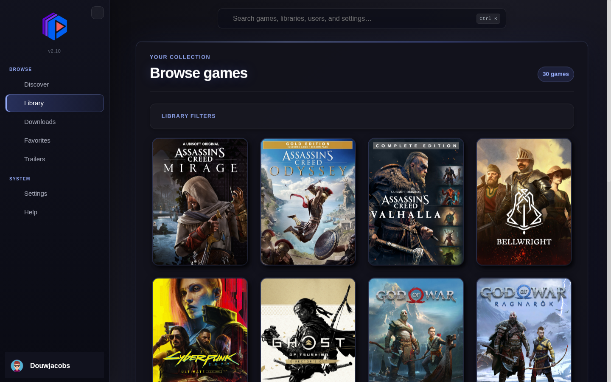

# GameLibrary

GameLibrary is a self-hosted interface for organizing and sharing a game collection. It scans game folders, enriches them with metadata and artwork, and provides discovery, streaming downloads, requests, user management, and browser-based retro gaming.

> GameLibrary is intended for legally owned software. It does not condone unauthorized distribution of copyrighted material.



## Features

- Searchable, filterable game library with IGDB metadata and artwork
- Discovery, favorites, play-status tracking, updates, and extras
- Streaming ZIP downloads without temporary archive files
- Game requests with edition selection and administrator workflow
- Multiple users, invitations, roles, password reset, and notifications
- Custom branding, site-wide themes, and an integrated theme builder
- Browser-based support for many retro game formats through Webretro

## Docker installation

### Requirements

- Docker Engine
- Docker Compose v2 (`docker compose`)
- A directory containing your games

### 1. Download the deployment files

```bash
git clone --depth 1 https://github.com/DouwJacobs/sharewarez.git gamelibrary
cd gamelibrary
cp .env.docker.example .env
```

### 2. Configure `.env`

The deployment uses the published image:

```env
GAME_LIBRARY_IMAGE=douwjacobs/gamelibrary:latest
```

At minimum, change these values:

```env
# Absolute path on the Docker host. The container mounts it read-only at /storage.
DATA_FOLDER_WAREZ=/absolute/path/to/your/games

# Persistent artwork, themes, and other library data.
LIBRARY_HOST_PATH=./data/library

# Generate with: openssl rand -hex 32
SECRET_KEY=replace-with-a-unique-random-value

POSTGRES_USER=gamelibrary
POSTGRES_PASSWORD=replace-with-a-strong-password
POSTGRES_DB=gamelibrary
DATABASE_URL=postgresql://gamelibrary:replace-with-a-strong-password@db:5432/gamelibrary
```

`POSTGRES_PASSWORD` and the password inside `DATABASE_URL` must match. URL-encode the password if it contains reserved URL characters.

### 3. Start GameLibrary

```bash
docker compose pull
docker compose up -d
```

Open [http://localhost:5006](http://localhost:5006) and complete the setup wizard to create the administrator account.

## Updating

The `latest` tag tracks the latest published GameLibrary release:

```bash
docker compose pull
docker compose up -d
```

Docker recreates the application container while retaining the PostgreSQL volume and configured library storage.

## Common commands

```bash
# View application and database logs
docker compose logs -f

# Show container status
docker compose ps

# Restart the application
docker compose restart app

# Stop the deployment without deleting its data
docker compose down
```

## Storage and ports

| Resource | Docker location | Purpose |
| --- | --- | --- |
| `${DATA_FOLDER_WAREZ}` | `/storage` (read-only) | Game files exposed for scanning and downloads |
| `${LIBRARY_HOST_PATH}` | `/app/sharewarez/static/library` | Artwork, themes, and persistent library assets |
| `db_data` volume | PostgreSQL data directory | Accounts, settings, and library metadata |
| Port `5006` | Application HTTP port | GameLibrary web interface |

To expose a different host port, change the Compose mapping from `5006:5006` to, for example, `8080:5006`.

## Performance

The default deployment uses two application workers for concurrent users and streaming downloads. For a small memory-constrained installation, set `WEB_WORKERS=1`. Database pool settings can normally remain at their supplied defaults.

## Support and credits

- Report problems through [GitHub Issues](https://github.com/DouwJacobs/sharewarez/issues)
- Join the [Discord community](https://discord.gg/WTwp236zU7)
- GameLibrary was forked from [SharewareZ](https://github.com/axewater/sharewarez)
- Browser-based retro gaming is powered by [Webretro](https://github.com/BinBashBanana/webretro)
